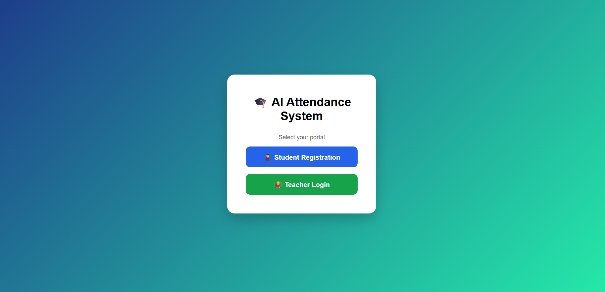
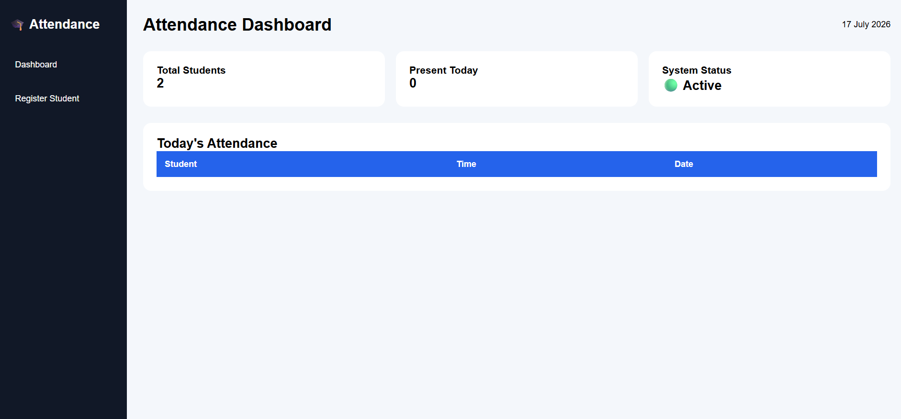
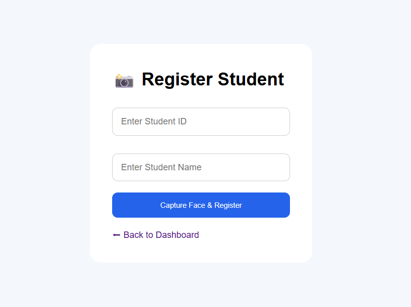
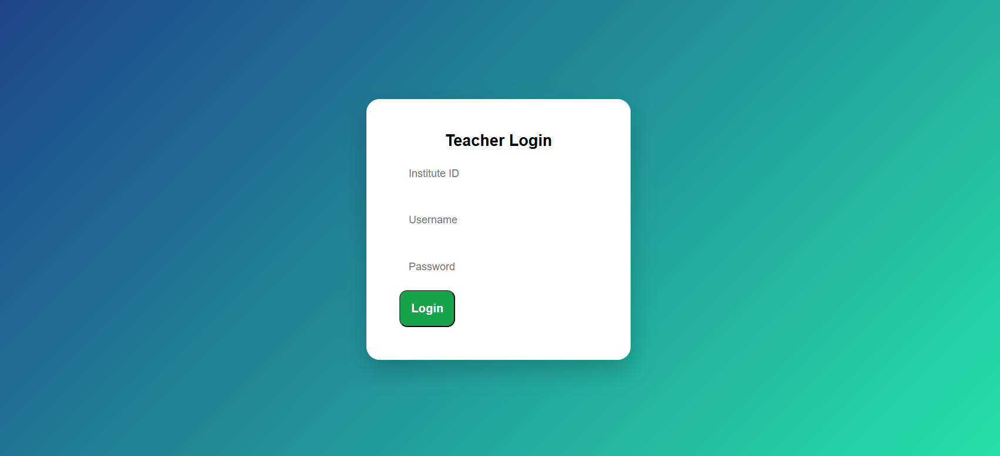
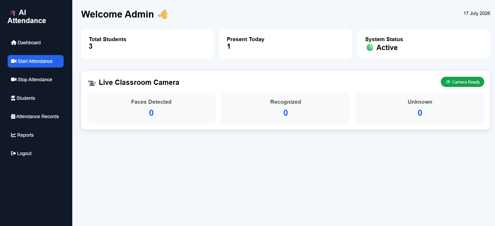
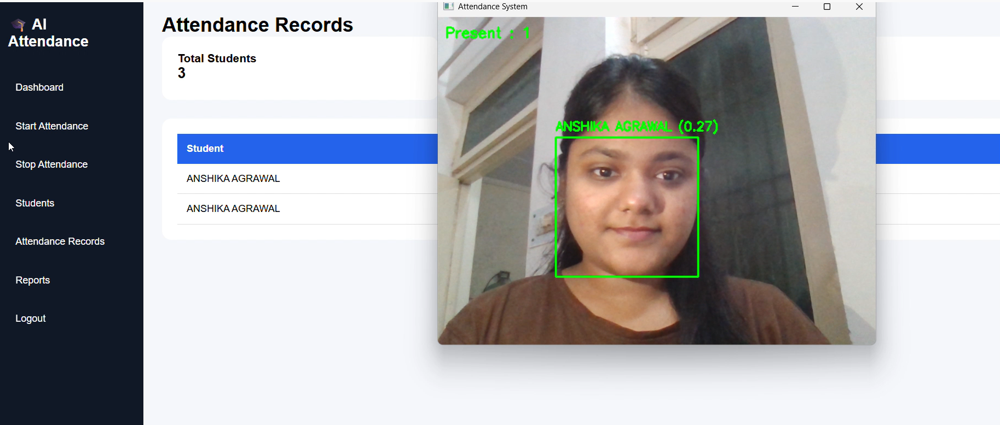
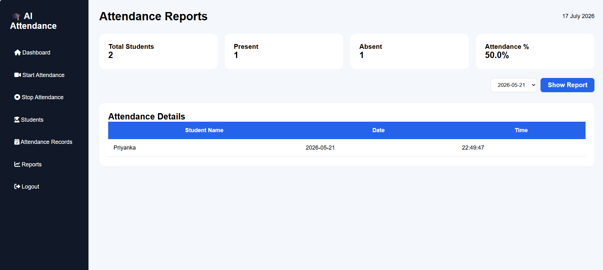

# 🤖 AI Attendance Management System

An AI-powered attendance management system that uses face recognition to automate attendance marking. The application provides separate dashboards for students and teachers, ensuring an organized and user-friendly experience.


---

## ✨ Features

- AI-powered face recognition attendance
- Student self-registration
- Secure Teacher Login
- Teacher Dashboard
- Student Dashboard
- Automatic attendance marking
- Attendance records management
- Duplicate attendance prevention
- Real-time face detection using OpenCV

---

## 🛠️ Tech Stack

- Python
- Flask
- OpenCV
- face_recognition
- HTML5
- CSS3
- JavaScript

---

## 📸 Screenshots

### 🏠 Home Page



---

### 👨‍🎓 Student Registration

New students can directly register from the Student Dashboard before using the attendance system.

<p>
  
    
</p>

---

### 👨‍🏫 Teacher Login

Teachers can securely log in to access attendance records and manage students.



---

### 👨‍🏫 Teacher Dashboard



---

### 📷 Face Recognition Attendance



---

### 📋 Attendance Report



## 📁 Project Structure

```
AI-Attendance-System
│── static/
│── templates/
│── students/
│── attendance_records/
│── app.py
│── database.py
│── face_system.py
│── utils.py
│── encodings.pkl
│── requirements.txt
│── README.md
```

---

## 🚀 Installation

```bash
git clone https://github.com/anshika2410-hub/AI-Attendance-System.git

cd AI-Attendance-System

pip install -r requirements.txt

python app.py
```

---

## 🚀 Future Improvements

- Super Admin Dashboard
- Advanced analytics & reports
- Cloud database integration
- Email notifications
- Attendance export (PDF/Excel)
- Mobile application

---

## 📬 Contact

**Anshika Agrawal**

* GitHub: https://github.com/anshika2410-hub
* LinkedIn: https://www.linkedin.com/in/contact-anshikaagrawal/
* Email: anshikaagrawal2410@gmail.com

## 🤝 Contributing

Contributions, suggestions, and feedback are welcome. Feel free to fork the repository, create a new branch, and submit a pull request.

## 📜 License

This project is available for educational and personal use.

---

⭐ If you found this project helpful, consider giving it a star on GitHub.
